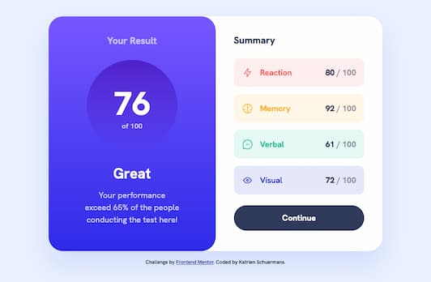

# Frontend Mentor - Results summary component solution

This is a solution to the [Results summary component challenge on Frontend Mentor](https://www.frontendmentor.io/challenges/results-summary-component-CE_K6s0maV). Frontend Mentor challenges help you improve your coding skills by building realistic projects.

## Table of contents

- [Overview](#overview)
  - [The challenge](#the-challenge)
  - [Screenshot](#screenshot)
  - [Links](#links)
- [My process](#my-process)
  - [Built with](#built-with)
  - [What I learned](#what-i-learned)
  - [Useful resources](#useful-resources)
- [Author](#author)

## Overview

### The challenge

Users should be able to:

- View the optimal layout for the interface depending on their device's screen size
- See hover and focus states for all interactive elements on the page
- **Bonus**: Use the local JSON data to dynamically populate the content

### Screenshot




### Links

- Solution URL: [Github](https://github.com/graficdoctor/fe-24-001-results-summary-component)
- Live Site URL: [Add live site URL here](https://your-live-site-url.com)

## My process

### Built with

- Semantic HTML5 markup
- CSS custom properties
- Flexbox
- CSS Grid
- Mobile-first workflow

### What I learned

I'm still learning how to work with animations. I had an idea of which animation I wanted to implement but s I'd never done it before I found the solution with Chat GPT.

```css
.result-circle h2 {
	color: var(--clr-neutral-100);
	font-weight: 800;
	font-size: 3.5rem;
	margin: 0;
	animation: countUp 2s ease-out;
	animation-fill-mode: forwards;
	opacity: 0;
}

@keyframes countUp {
	to {
		opacity: 1;
	}
}
```

```js
function animateNumber() {
	const resultNumberDisplay = document.querySelector('.result-circle h2');
	const targetNumber = 76;
	let currentNumber = 0;

	const intervalId = setInterval(() => {
		resultNumberDisplay.textContent = currentNumber;
		if (currentNumber === targetNumber) {
			clearInterval(intervalId);
		}
		currentNumber++;
	}, 100);
}
```

### Useful resources

- [How do I apply opacity to a CSS color variable?](https://stackoverflow.com/questions/40010597/how-do-i-apply-opacity-to-a-css-color-variable) - I knew I could assign alpha-values to CSS-variables, but I didn't know how. This article helped me understand how and why.

## Author

- Website - [Add your name here](https://www.your-site.com)
- Frontend Mentor - [@yourusername](https://www.frontendmentor.io/profile/yourusername)
- Twitter - [@yourusername](https://www.twitter.com/yourusername)
